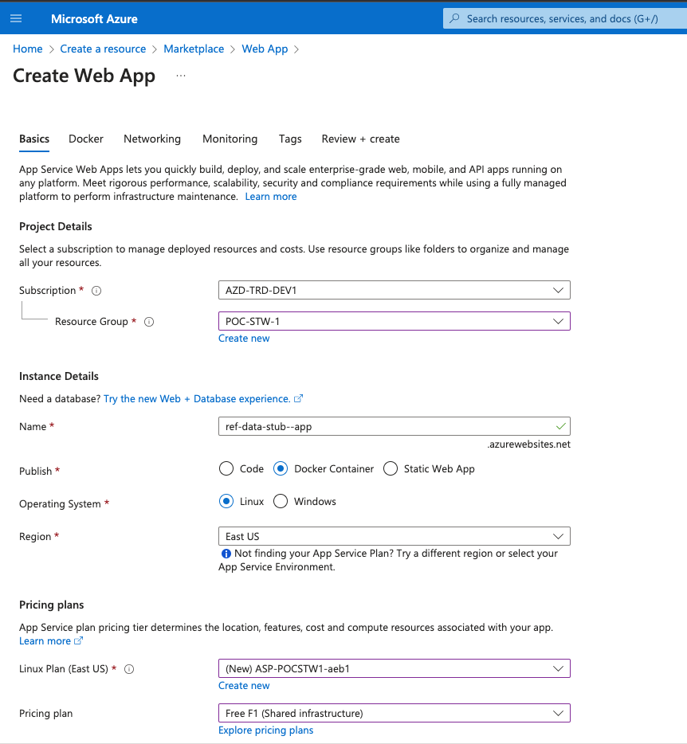
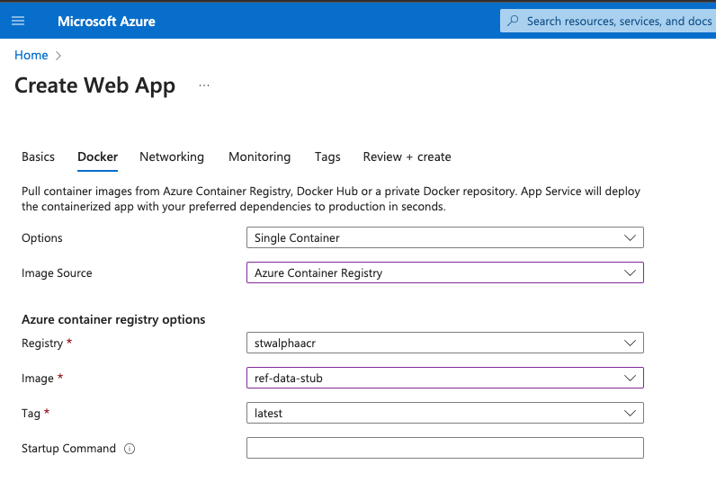

# Orchestration Layer Stubs

## Wiremock

The wiremock stub can be run with `./run.sh`.

## HTTP requests

The `requests` folder contains `.http` files which can be used to send requests via the IntelliJ
[HTTP Client plugin](https://www.jetbrains.com/help/idea/http-client-in-product-code-editor.html).

### Stub folders

Inside the container, the WireMock uses /home/wiremock as the root from which it reads
the `mappings` and `__files` directories. This means you can mount a directory containing these from
your host machine into Docker and WireMock will load the stub mappings.

## Docker

Wiremock has an official [docker image](https://wiremock.org/docs/docker/).

```dockerfile
FROM wiremock/wiremock:2.35.0
COPY mappings /home/wiremock/mappings
COPY __files /home/wiremock/__files
```

## Build and test locally

1. Build the docker image using 
`docker build --tag stwalphaacr.azurecr.io/ref-data-stub .`

2. Test the docker container using 
`docker run -p 8080:8080 stwalphaacr.azurecr.io/ref-data-stub`

## Deploy the stub to the azure container registry

See more detail [Azure App service with custom container tutorial](https://learn.microsoft.com/en-us/azure/app-service/tutorial-custom-container?tabs=azure-portal&pivots=container-linux).

3. Login to azure
`az acr login --name stwalphaacr.azurecr.io`
4. Run the following command to deploy it to azure
`docker push stwalphaacr.azurecr.io/ref-data-stub`

## Create the azure web app

1. Click on `create a resource` from the dashboard. 
2. Select the `Web app`.
3. Complete the following 2 tabs(Basic and docker) as shown. Leaving all other tabs set to the default.


4. Click the `Review and create button`

## Update and redeploy


