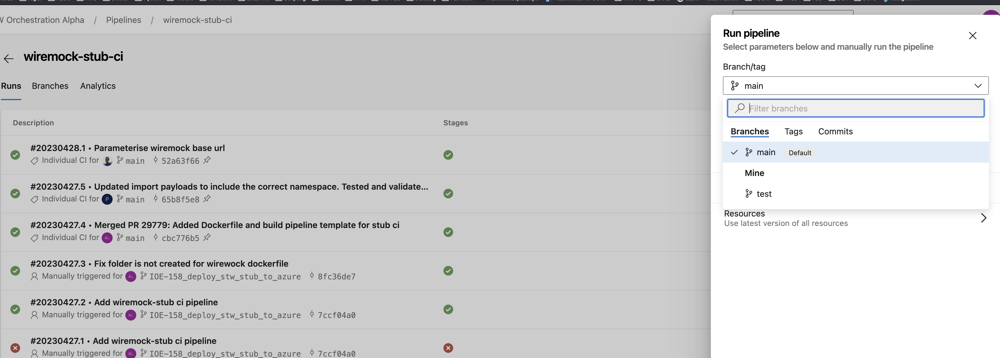
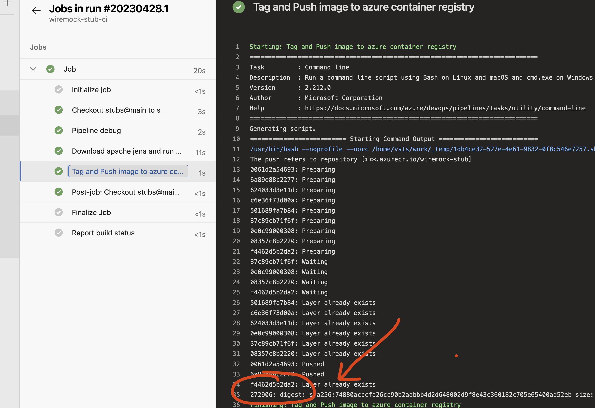
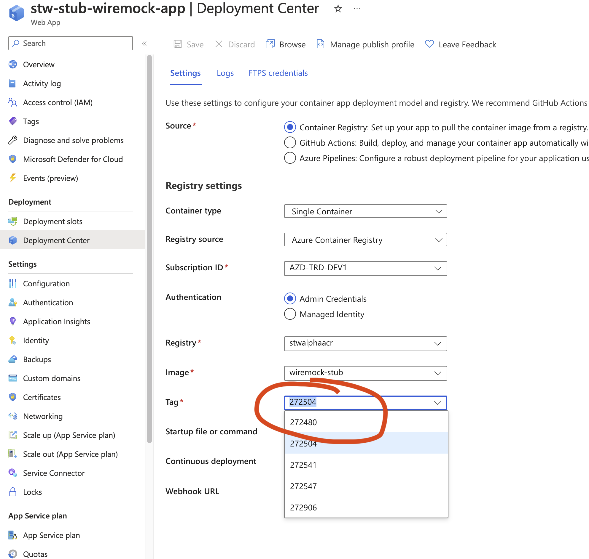

# Orchestration Layer Stubs

## Wiremock

Wiremock stub
for [IPAFFS Trade API](https://tst-developer-portal.trade.azure.defra.cloud/explore-apis/ipaffs-api/api).

Run with `./run.sh`.

## HTTP requests

The `requests` folder contains `.http` files which can be used to send requests via the IntelliJ
[HTTP Client plugin](https://www.jetbrains.com/help/idea/http-client-in-product-code-editor.html).

## Deploy wiremock to azure app service as container

Wiremock has an official [docker image](https://wiremock.org/docs/docker/).

See more
detail [Azure App service with custom container tutorial](https://learn.microsoft.com/en-us/azure/app-service/tutorial-custom-container?tabs=azure-portal&pivots=container-linux).

TL;DR:

1. Create Azure Container Registry, Azure app service with an app service plan
2. Use Dockerfile to embed stub mapping files into image
3. Push custom image into Azure container registry (See wiremock-stub-ci.yml)
4. Run custom image in Azure app service

### Stub folders

Inside the container, the WireMock uses /home/wiremock as the root from which it reads
the `mappings` and `__files` directories. This means you can mount a directory containing these from
your host machine into Docker and WireMock will load the stub mappings.

See example of Dockerfile

```dockerfile
FROM wiremock/wiremock:2.35.0
COPY mappings /home/wiremock/mappings
COPY __files /home/wiremock/__files
```

## Build and push custom image

ADO pipeline: [wiremock-stub-ci](https://dev.azure.com/defragovuk/STW%20Orchestration%20Alpha/_build?definitionId=3611)

Option 1. Merge new code into main branch, new image tagged and pushed automatically by pipeline

Option 2. Manually run pipeline for your test branch can be done if you specify it.



### Updating container images

A new image version tagged with the pipeline build id can be found after pipeline run.



You just need to update the app service to use new image tag.


